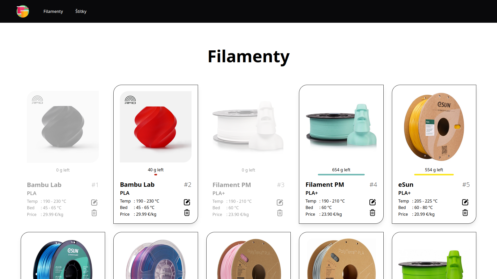
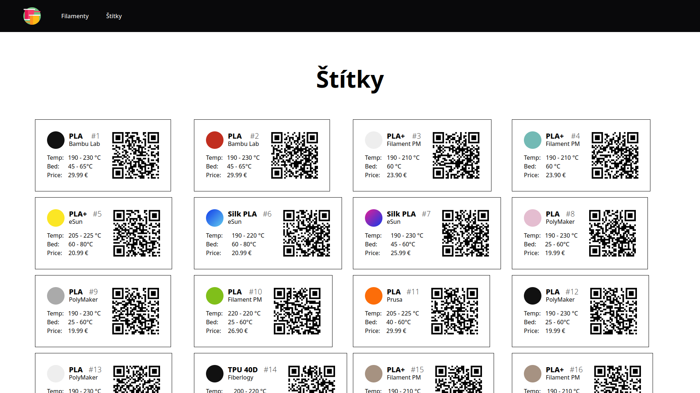
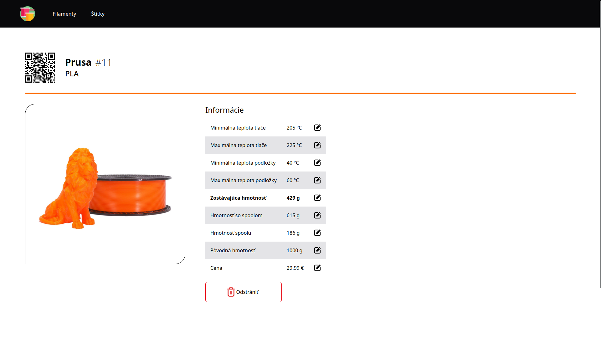

# Filamenty

Fullstack webová aplikácia na správu filamentov do 3D tlačiarne

Aplikácia umožňuje vytvoriť zoznam filamentov a následne v ňom upravovať, pridávať a odoberať filamenty  
Navyše aplikácia generuje pre filamenty štítky s QR kódami, ktoré po naskenovaní umožňujú jednoducho spravovať dané
filamenty

  
  


**Obsah**

<!--toc:start-->

- [Filamenty](#filamenty)
    - [Použité technológie](#použité-technológie)
    - [Požiadavky a spúštanie aplikácie](#požiadavky-a-spúštanie-aplikácie)
    - [Databáza](#databáza)
        - [Štruktúra tabuľky `filaments`](#štruktúra-tabuľky-filaments)
            - [Príklad záznamov](#príklad-záznamov)
    - [API](#api)
        - [`GET http://localhost:5000/api/`](#get-httplocalhost5000api)
        - [`GET http://localhost:5000/api/filaments/`](#get-httplocalhost5000apifilaments)
        - [`POST http://localhost:5000/api/filaments/`](#post-httplocalhost5000apifilaments)
        - [`GET http://localhost:5000/api/filaments/<int:id>/`](#get-httplocalhost5000apifilamentsintid)
        - [`PUT http://localhost:5000/api/filaments/<int:id>/`](#put-httplocalhost5000apifilamentsintid)
        - [`DELETE http://localhost:5000/api/filaments/<int:id>/`](#delete-httplocalhost5000apifilamentsintid)
        - [`GET http://locahost:5000/api/filaments/random/`](#get-httplocahost5000apifilamentsrandom)
        - [`GET http://locahost:5000/api/info/`](#get-httplocahost5000apiinfo)
    - [Použité zdroje](#použité-zdroje)
  <!--toc:end-->

## Použité technológie

- Backend
    - Python - Hlavný programovací jazyk
    - Flask - Webový framework na vytvorenie API a obsluhu požiadaviek
    - SQLite - Databáza na uchovávanie informácií o filamentoch
    - qrcode - Python knižnica na generovanie QR kódov
- Frontend
    - React a JavaScript - Tvorba dynamického používateľského rozhrania
    - Tailwind CSS - CSS framework na vizuálne formátovanie webovej aplikácie
    - Axios - Vykonávanie HTTP požiadaviek
- Ostatné
    - Docker a docker-compose - Kontajnerizácia pre jednoduchšie nasadenie aplikácie

## Požiadavky a spúštanie aplikácie

1. Klonovanie Git repozitára
    - Repozitár je verejne dostupný na [GitHub](https://github.com/cyprich/filamenty)
    - Uistite sa, že máte nainštalovaný _git_, a spustite nasledovný príkaz
        - `git clone https://github.com/cyprich/filamenty filamenty`
    - Následne sa presuňte do priečinku klonovaného repozitára
        - `cd filamenty`
1. Inštalácia potrebných balíčkov
    - `docker`
    - `docker-compose`
    - Konkrétny príkaz na inštaláciu balíčkov závisí od vašej Linux distribúcie, napr.:
        - `sudo apt install docker docker-compose` pre Ubunutu-based distribúcie
        - `sudo pacman -Syu docker docker-compose` pre Arch-based distribúcie
1. Spustenie systémových procesov pre Docker
    - `sudo systemctl start docker`
    - `sudo systemctl enable docker` - _nepovinné_ - automaticky spustí proces pri bootovaní zariadenia
1. Pridanie používateľa do skupiny _docker_
    - `sudo usermod -aG docker ${USER}`
1. Používateľ sa musí odhlásiť a znova prihlásiť pre aplikovanie zmien
1. Kroky pred prvým spustením na novom zariadení
    - Nastavenie IP adresy
        - Zistite IP adresu vášho zariadenia cez GUI (v nastaveniach) alebo pomocou príkazu `ip -c address`
        - Spustite súbor _change_ip.sh_ príkazom `./change_ip.sh` a zadajte IP adresu vášho zariadenia
        - IP adresa by mala vyzerať nejak takto: _192.168.1.100_
    - _Nepovinné_ - naplnenie databázy počiatočnými hodnotami
        - **Pozor!** - spustenie súboru vymaže všetky údaje v terajšej databáze bez možnosti návratu!
        - Na spustenie súboru je potrebné mať nainštalovaný balíček _python3_
        - `cd backend`
        - `python3 create_db.py`
        - `cd ..`
1. Spustenie aplikácie pomocou súboru _run.sh_
    - `./run.sh`
1. Príkazový riadok nechajte otvorený
1. Aplikáciu zobrazíte vo webovom prehliadači na adrese `http://vaša_IP_adresa:3000` alebo `http://localhost:3000`
1. Pre zastavenie aplikácie použite klávesovú skratku `ctrl + c` v príkazovom riadku

## Databáza

### Štruktúra tabuľky `filaments`

| Názov hodnoty      | Typ       | Popis                                                                                                               |
|--------------------|-----------|---------------------------------------------------------------------------------------------------------------------|
| `id`               | `INTEGER` | Jednoznačný číselný identifikátor filamentu, určuje sa automaticky                                                  |
| `vendor`           | `TEXT`    | Výrobca filamentu                                                                                                   |
| `meterial`         | `TEXT`    | Materiál filamentu (napr. PLA, TPU)                                                                                 |
| `price`            | `REAL`    | Cena filamentu                                                                                                      |
| `color_hex`        | `TEXT`    | Farba filamentu reprezentovaná hexadecimálnym kódom farby (napr. `#111111`)                                         |
| `color_second_hex` | `TEXT`    | Sekundárna farba filamentu reprezentovaná hexadecimálnym kódom farby (nepovinné, iba pri viacfarebných filamentoch) |
| `weight`           | `INT`     | Aktuálne zostávajúca hmotnosť filamentu + hmotnosť cievky, na ktorej je filament navinutý (v gramoch)               |
| `weight_orig`      | `INT`     | Pôvodná hmotnosť filamentu (v gramoch)                                                                              |
| `weight_spool`     | `INT`     | Hmotnosť cievky, na ktorej je filament navinutý (v gramoch)                                                         |
| `temp_min`         | `INT`     | Minimálna odporúčaná teplota tlače (v stupňoch Celzia)                                                              |
| `temp_max`         | `INT`     | Maximálna odporúčaná teplota tlače (v stupňoch Celzia)                                                              |
| `temp_bed_min`     | `INT`     | Minimálna odporúčaná teplota podložky (v stupňoch Celzia)                                                           |
| `temp_bed_max`     | `INT`     | Maximálna odporúčaná teplota podložky (v stupňoch Celzia)                                                           |
| `image_url`        | `TEXT`    | URL adresa obrázku filamentu                                                                                        |

- Stĺpec `id` je **primárny kľúč** databázy
- Kombinácia stĺpcov `vendor`, `material` a `color_hex` je **unikátna** (v databáze nemôžu existovať dva filamenty s
  rovnakým výrobcom, materiálom a farbou)

#### Príklad záznamov

| id | vendor    | material | price | color_hex | color_second_hex | weight | weight_orig | weight_spool | temp_min | temp_max | temp_bed_min | temp_bed_max | image_url                                          |
|----|-----------|----------|-------|-----------|------------------|--------|-------------|--------------|----------|----------|--------------|--------------|----------------------------------------------------|
| 1  | Bambu Lab | PLA      | 29.99 | #111111   | NULL             | 290    | 1000        | 250          | 190      | 230      | 45           | 65           | [http://192.168.1.10/api/images/filaments/1.png]() |
| 2  | eSun      | Silk PLA | 25.99 | #e41e95   | #123cea          | 876    | 1000        | 220          | 190      | 230      | 45           | 60           | [http://192.168.1.10/api/images/filaments/2.png]() |
| 3  | Fiberlogy | TPU 40D  | 25.30 | #222222   | NULL             | 438    | 500         | 250          | 200      | 220      | 50           | 70           | [http://192.168.1.10/api/images/filaments/3.png]() |

## API

Base URL: `http://localhost:5000/api/`

### `GET http://localhost:5000/api/`

Vráti uvítaciu správu od backendu

_Response_

```json
{
  "message": "Hello from backend!"
}
```

### `GET http://localhost:5000/api/filaments/`

Vráti informácie o všetkých filamentoch

_Response_

```json
{
{
  "filaments": [
    {
      "color_hex": "#111",
      "color_second_hex": null,
      "id": 1,
      "image_url": "http://192.168.1.10:5000/api/images/filaments/1.png",
      "material": "PLA",
      "price": 29.99,
      "temp_bed_max": 65,
      "temp_bed_min": 45,
      "temp_max": 230,
      "temp_min": 190,
      "vendor": "Bambu Lab",
      "weight": 0,
      "weight_orig": 1000,
      "weight_spool": 250
    },
    {
      "color_hex": "#c12e1f",
      "color_second_hex": null,
      "id": 2,
      "image_url": "http://192.168.1.10:5000/api/images/filaments/2.png",
      "material": "PLA",
      "price": 29.99,
      "temp_bed_max": 65,
      "temp_bed_min": 45,
      "temp_max": 230,
      "temp_min": 190,
      "vendor": "Bambu Lab",
      "weight": 290,
      "weight_orig": 1000,
      "weight_spool": 250
    }
  ]
}
}
```

### `POST http://localhost:5000/api/filaments/`

Pridá nový filament do databázy

_Body (form data)_

```
vendor: "ABC"
material: "XYZ"
price: "19.99"
color_hex: "#ffffff"
weight: "500"
weight_orig: "1000"
weight_spool: "250"
temp_min: "200"
temp_max: "220"
temp_bed_min: "50"
temp_bed_max: "60"
image: <file>
```

_Response_

```json
{
  "filaments": {
    "color_hex": "#ffffff",
    "color_second_hex": null,
    "id": 3,
    "image_url": "http://192.168.1.10:5000/api/images/filaments/3.png",
    "material": "XYZ",
    "price": 19.99,
    "temp_bed_max": 60,
    "temp_bed_min": 50,
    "temp_max": 220,
    "temp_min": 200,
    "vendor": "ABC",
    "weight": 500,
    "weight_orig": 1000,
    "weight_spool": 250
  }
}
```

### `GET http://localhost:5000/api/filaments/<int:id>/`

Vráti informácie o konkrétnom filamente na základe `id`

_Response_

```json
{
  "filaments": {
    "color_hex": "#73bab5",
    "color_second_hex": null,
    "id": 4,
    "image_url": "http://192.168.1.10:5000/api/images/filaments/4.png",
    "material": "PLA+",
    "price": 23.9,
    "temp_bed_max": null,
    "temp_bed_min": 60,
    "temp_max": 210,
    "temp_min": 190,
    "vendor": "Filament PM",
    "weight": 870,
    "weight_orig": 1000,
    "weight_spool": 216
  }
}
```

### `PUT http://localhost:5000/api/filaments/<int:id>/`

Aktualizuje informáciu o konkrétnom filamente na základe `id`

_Body (JSON)_

```json
{
  "key": "weight",
  "value": "199"
}
```

_Response_

```json
{
  "filaments": {
    "color_hex": "#111111",
    "color_second_hex": null,
    "id": 1,
    "image_url": "http://192.168.1.10:5000/api/images/filaments/1.png",
    "material": "PLA",
    "price": 29.99,
    "temp_bed_max": 65,
    "temp_bed_min": 45,
    "temp_max": 230,
    "temp_min": 190,
    "vendor": "Bambu Lab",
    "weight": 199,
    "weight_orig": 1000,
    "weight_spool": 250
  }
}
```

### `DELETE http://localhost:5000/api/filaments/<int:id>/`

Vymaže konkrétny filament na základe `id`

_Response_

```json
{
  "filaments": {
    "color_hex": "#111111",
    "color_second_hex": null,
    "id": 1,
    "image_url": "http://192.168.1.10:5000/api/images/filaments/1.png",
    "material": "PLA",
    "price": 29.99,
    "temp_bed_max": 65,
    "temp_bed_min": 45,
    "temp_max": 230,
    "temp_min": 190,
    "vendor": "Bambu Lab",
    "weight": 199,
    "weight_orig": 1000,
    "weight_spool": 250
  }
}
```

### `GET http://locahost:5000/api/filaments/random/`

Vráti informácie o filamente

_Response_

```json
{
  "filaments": {
    "color_hex": "#111111",
    "color_second_hex": null,
    "id": 1,
    "image_url": "http://192.168.1.10:5000/api/images/filaments/1.png",
    "material": "PLA",
    "price": 29.99,
    "temp_bed_max": 65,
    "temp_bed_min": 45,
    "temp_max": 230,
    "temp_min": 190,
    "vendor": "Bambu Lab",
    "weight": 199,
    "weight_orig": 1000,
    "weight_spool": 250
  }
}
```

### `GET http://locahost:5000/api/info/`

Vráti všeobecné informácie of filamentoch v databáze

_Response_

```json
{
  "filament_count": 15,
  "ids": [
    2,
    4,
    6,
    7,
    8
  ],
  "invalid_ids": [
    1,
    3,
    5
  ]
}
```

## Použité zdroje

| Popis                                                                    | Autor                                                                                             | Súbor                                                                | Link                                                                                                                                                                                                                       |
|--------------------------------------------------------------------------|---------------------------------------------------------------------------------------------------|----------------------------------------------------------------------|----------------------------------------------------------------------------------------------------------------------------------------------------------------------------------------------------------------------------|
| Dokumentácia Python knižnice _qrcode_                                    | Lincoln Loop                                                                                      | `backend/generate_qrcodes.py` riadky 45 - 50                         | [https://pypi.org/project/qrcode/](https://pypi.org/project/qrcode/)                                                                                                                                                       |
| Dokumentácia Tailwind CSS                                                | Tailwind Labs Inc.                                                                                | `frontend/src/Filaments.jsx` riadky 27 - 89                          | [https://tailwindcss.com/](https://tailwindcss.com/)                                                                                                                                                                       |
| Článok _"How to use Axios With React"_                                   | Reed                                                                                              | `frontend/src/Filaments.jsx` riadky 18 - 24                          | [https://www.freecodecamp.org/news/how-to-use-axios-with-react/](https://www.freecodecamp.org/news/how-to-use-axios-with-react/)                                                                                           |
| Článok _"How to upload files in React app using Axios?"_                 | Ushna Ijaz                                                                                        | `frontend/src/AddFilament.jsx` riadky 31 - 65                        | [https://rapidapi.com/guides/upload-files-react-axios](https://rapidapi.com/guides/upload-files-react-axios)                                                                                                               |
| Príspevok _"Get the data received in a Flask request"_ na Stack Overflow | bkoiki950                                                                                         | `backend/main.py` riadok 118                                         | [https://stackoverflow.com/a/69941645](https://stackoverflow.com/a/69941645)                                                                                                                                               |
| Hlavná ikonka stránky                                                    | Freepik                                                                                           | `frontend/src/images/icon.png` </br>`frontend/public/favicon.ico`    | [https://www.flaticon.com/free-icon/3d-printing-filament_2442882](https://www.flaticon.com/free-icon/3d-printing-filament_2442882)                                                                                         |
| Ikonka pre chýbajúci obrázok                                             | Vectorink                                                                                         | `backend/images/filaments/unknown.png`                               | [https://en.m.wikipedia.org/wiki/File:Icon-round-Question_mark.svg](https://en.m.wikipedia.org/wiki/File:Icon-round-Question_mark.svg)                                                                                     |
| Ostatné použité ikonky                                                   | Ilham Fitroutul Hayat                                                                             | `frontend/src/images/edit.png` </br>`frontend/src/images/delete.png` | [https://www.flaticon.com/search?author_id=448&style_id=1223](https://www.flaticon.com/search?author_id=448&style_id=1223)                                                                                                 |
| Obrázky filamentov                                                       | Bambu Lab EU </br>Plasty Mladeč </br>eSun </br>Majkl3D-Technology s.r.o. </br>Prusa Research a.s. | Všetky súbory v priečinku `backend/images/filaments`                 | [eu.store.bambulab.com](eu.store.bambulab.com) </br> [www.filament-pm.cz](www.filament-pm.cz) </br> [esun3dstoreeu.com](esun3dstoreeu.com) </br> [www.majkl3d.sk](www.majkl3d.sk) </br> [www.prusa3d.com](www.prusa3d.com) |
